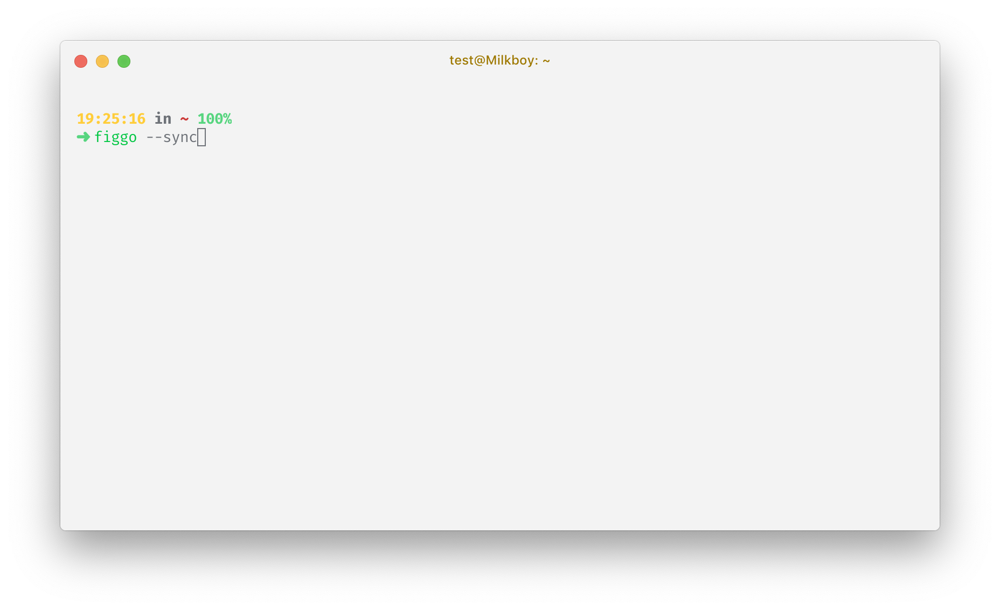

<h1 align="center">Figgo</h1>
<p align="center">A CLI tool make your design tokens stay up to date with your Figma design styleguide</p>



## Install Figgo

`npm i figgo -g`

## Figma Guide

- Create three frames named as `Typography`, `Palette` and `Space`.
- Place your design styleguide to frames following this [Example](https://www.figma.com/file/ULXceywc0RjE0MFYNgOiZDrl/Figgo)

## Basic CLI Usage

```shell
How to use
    $ figgo [<options> ...]
    Options
      --init, -i         Setup figma board
      --sync, -s         Sync tokens
      --edit, -e         Edit board information (not ready yet)
      --list, -l         List boards
      --remove, -r       Remove board
      --help, -h         Show help message
      --version, -v      Show installed version
    Examples
      $ figgo --init
      $ figgo --init board_name board_id output_directory_absolute_path output_format[js|scss]
      $ figgp --edit board_name (not ready yet)
      $ figgo --list
      $ figgo --sync
      $ figgo --sync board_name
      $ figgo --remove board_name
      $ figgo --help
      $ figgo --version
```

## Dev Guide

- Installation
  `yarn install`
- development
  `yarn start [options]`
- test
  `yarn test`
- build
  `yarn build`

## CHANGELOGS

- 0.1.1 🚀 Alive
- 0.1.2 ✍️ Readme
- 0.1.3 🛠 Fix minor issues

## TODOs

- [x] CLI listing board information
- [x] CLI specify board sync
- [x] js output supports
- [ ] Edit Figma board info from CLI
- [ ] Well-formatted and styled output in terminal
- [ ] More Screenshots and documentation

## License

MIT

## Credits

[Figma](https://www.figma.com)
